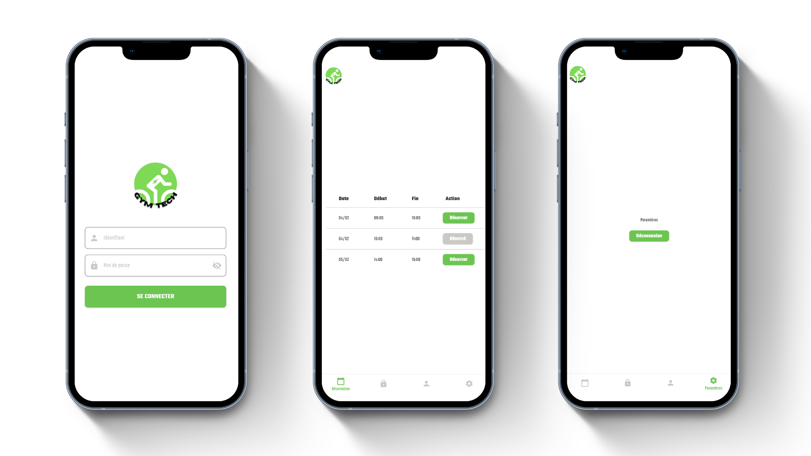

## 🏋🏼‍♂️ GymTech - Projet Scolaire (150h)

         ┌─────────────────────────────────────────────┐
         │    ____               _____         _       │
         │   / ___|_   _ _ __ __|_   _|__  ___| |__    │
         │  | |  _| | | | '_ ` _ \| |/ _ \/ __| '_ \   │
         │  | |_| | |_| | | | | | | |  __/ (__| | | |  │
         │   \____|\__, |_| |_| |_|_|\___|\___|_| |_|  │
         │         |___/                               │
         └─────────────────────────────────────────────┘

## 🖥️ Description

Le projet "GymTech" est un Projet de fin d'année de BTS CIEL Informatique & Réseaux qui permet d'aborder toutes les connaissances vu durant cette formation. Ce projet est réalisé en groupe de 3, a pour objectif de renforcer les compétences en **Développement web**, en **Développement d'applications mobiles**, et en **Systèmes & Maintenance Informatique**.

Les questions abordent des sujets fondamentaux étudié dans cette formation, cela permet de valider des connaissances de base mais aussi d'approfondir les les sujets plus complexes.

## 🚀 Aperçu de l'application mobile : **GymTech**

Lancement de l'application mobile GymTech : 28/01/2025.

<div style="text-align: center;">

</div>

## 🔥 Fonctionnalités

- **Vélo intelligent** : Le système connécté permet à l'utilsateur de recharger n'importe quel appareil via un port USB.
- **Applications mobile** : Cette application est indispensable pour avoir un suivi de ces performances grâce aux données ralatifs au compte utilisateur à créer et configuré, et l'accés au vestiaire et casier attitré.
- **Interface web** : L'interface est conçue pour gérer certaines fonctionnalités, le confort thermique, le taux d'humidité, réserver des créneaux de cours.

## 🛠️ Technologies utilisées

- **GanttProject** : Utilisé pour la gestion et planification du projet qui permet d'avoir un suivi de l'avancée du projet et évidemment de travailler en équipe et tout cela de façon centralisée.
- **Android Studio** : Editeur de texte (IDE) , utile pour le développement d'applications mobiles.
- **Flutter & Dart** : Langage de programmation et/ou Framework à déterminé pour concevoir l'application mobile.

## 🎯 Objectifs

Ce projet vise à retravailler & renforcer nos compétences relatifs à notre formation, en particulier en **Systèmes & Maintenance Informatique**, **Développement d'applications mobiles** et **Développement web** tout en permettant de réaliser un projet complet, dynamique et interactif. L'objectif est de pratiquer les fondamentaux des compétences requises à l'issu de notre formation et de perfectionner nos capacités à créer des applications interactives fonctionnels dans un but précis.

## 🏗️ Structure du Projet

### Frontend (Application Mobile Flutter)
```
lib/		          # Code source de l'application mobile
├── main.dart         # Initialise l'application Flutter 
├── models/           # Définit la structure des données manipulées
├── screens/          # Écrans de l'application
├── services/         # Communication avec l'API backend
├── utils/            # Éléments réutilisables 
└── widgets/          # Composants réutilisables
```

### Backend (API Node.js/Express)
```
api/		                 # Code source du serveur
├── controllers/            # Reçoit les requêtes HTTP, traite les données, renvoie la réponse
├── node_modules/           # L'entièreté des dépendances du projet
├── routes/                 # Définit les routes de l'API et les associe aux contrôleurs
├── scripts/                # Contient un script JavaScript qui haché les mots de passe
├── .env                    # Fichier de configuration pour les variables d'environnement
├── config.js               # Fichier de configuration principal de l'application
└── server.js               # Point d'entrée principal du serveur
```

## 🚀 Installation

1. Clonez ce dépôt sur votre machine locale :
   ```bash
   git clone https://github.com/enzo-mensier/GymTech.git"# GymTech-APP" 
